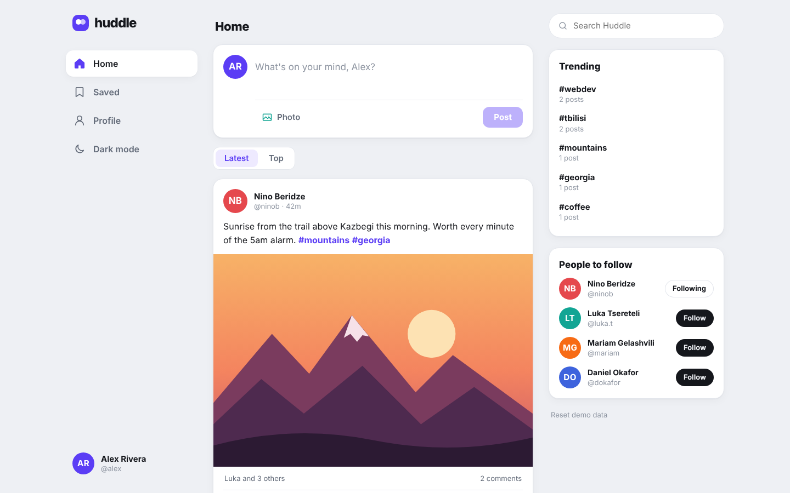
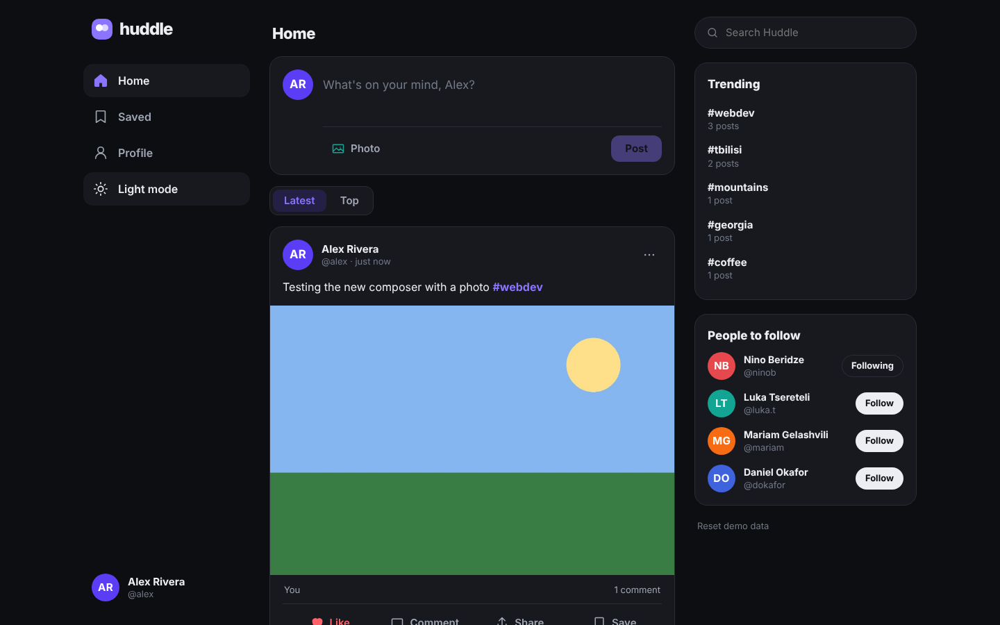
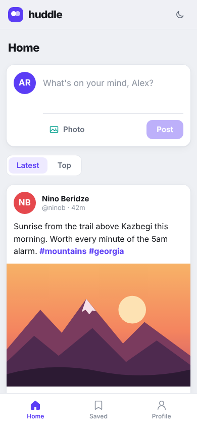

# Huddle

A responsive social feed built with React and TypeScript.

**Live demo:** _add your Vercel link here_



## Features

- **Create posts** with text and a photo. Photos are resized in the browser before saving, with a live character counter.
- **Like, comment, share and save.** Double-click a photo to like it, copy a post link, keep posts in your Saved list.
- **Hashtags** are clickable and filter the feed. Trending tags are counted from the posts.
- **Search** posts and people, sort by Latest or Top.
- **Profile page** with your posts and stats, and delete for your own posts.
- **Follow suggestions** with follow/unfollow.
- **Light and dark themes.**
- **Responsive layout:** three columns on desktop, an icon sidebar on tablets and a bottom tab bar on phones.
- **Saved in the browser.** Everything you do is stored in localStorage, with a button to reset the demo data.
- Empty states, keyboard focus styles and screen-reader labels throughout.

| Dark mode | Mobile |
| --- | --- |
|  |  |

## Tech stack

React 19 · TypeScript · Vite · plain CSS. No UI libraries.

## Run locally

```bash
npm install
npm run dev
```

## Structure

```
src/
  App.tsx              Layout, views, filters, search, trending
  store.ts             useReducer store with localStorage persistence
  data.ts              Demo users and posts
  components/
    Composer.tsx       New post with photo upload and resize
    PostCard.tsx       Post, likes, comments, menu
    RichText.tsx       Clickable hashtags
    Avatar.tsx, Icon.tsx
```

People in the demo are fictional. Photos are illustrations bundled with the app.
